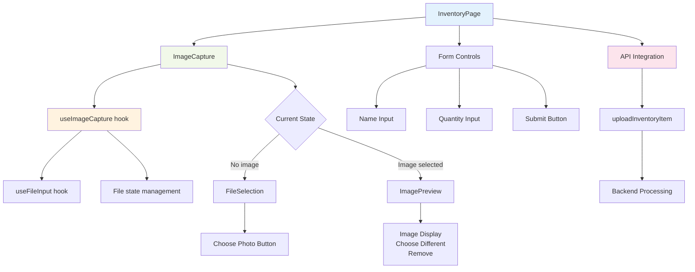

# 🔄 Component Architecture

## React Component Structure

This diagram illustrates the modular React component architecture:

- **Page Level**: `InventoryPage` as the main container component
- **Feature Components**: `ImageCapture` handles all image-related functionality
- **Custom Hooks**: Separation of concerns with `useImageCapture` and `useFileInput`
- **Conditional Rendering**: State-based UI switching between file selection and preview
- **API Integration**: Clean separation between UI components and backend communication

## Architecture Benefits

- **Reusability**: Custom hooks can be used across multiple components
- **Maintainability**: Clear separation of concerns and single responsibility
- **Testability**: Each component and hook can be tested independently
- **State Management**: Centralized file handling logic in custom hooks
