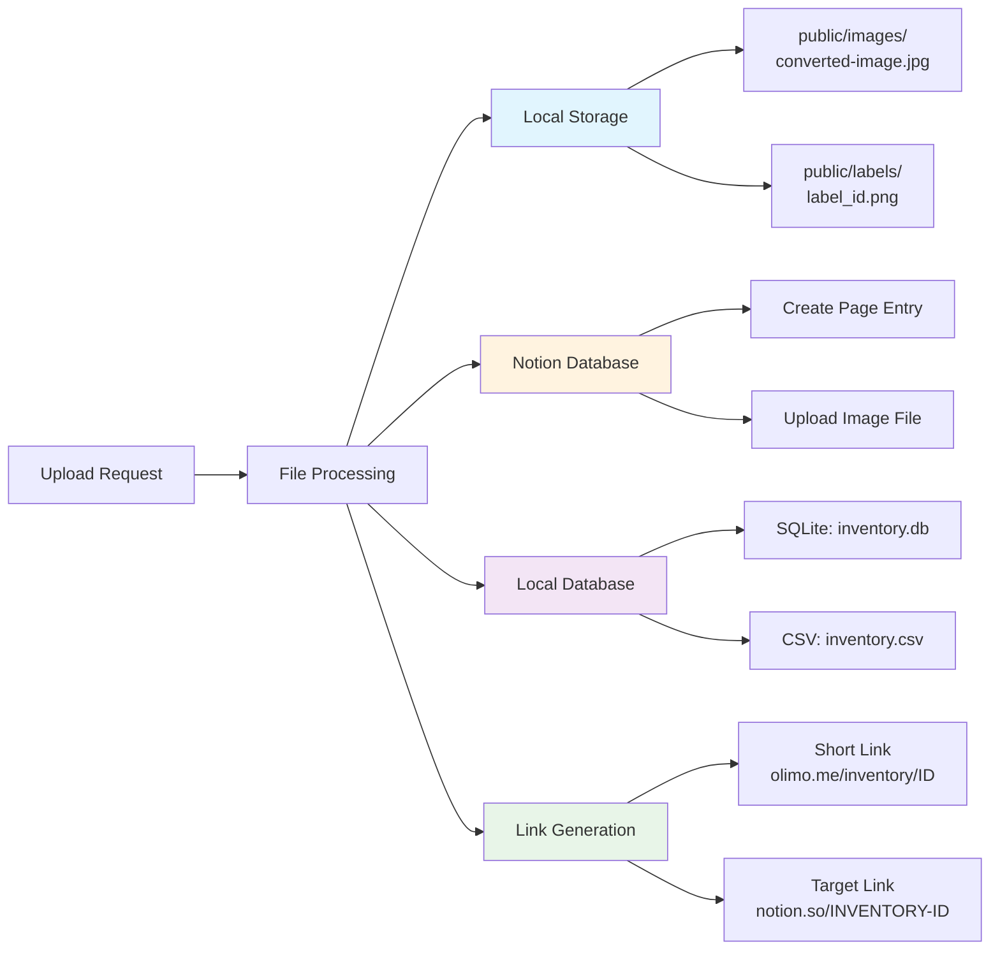

# 🗄️ Database & File Flow

## Data Storage Architecture

This diagram shows how data flows through different storage systems:

- **Local File Storage**: Images and generated labels stored in public directories for web access
- **Notion Integration**: Remote storage with rich page formatting and file attachments
- **Local Database**: Dual persistence with SQLite for structured queries and CSV for simple exports
- **Link Management**: Short link system for easy sharing and access to inventory items

## Storage Benefits

- **Redundancy**: Multiple storage layers ensure data availability
- **Performance**: Local storage for fast access, remote for collaboration
- **Accessibility**: Public directories enable direct file access via URLs
- **Integration**: Notion provides rich UI and collaboration features
