# 🏷️ Label Generation Flow

```mermaid
flowchart TD
    A[Label Generation Request] --> B[getLabelDimensions]
    B --> C[createLabelCanvas<br/>400x300px white background]
    
    C --> D[drawQRCode]
    D --> E[QR positioned left<br/>20px margin, centered vertically]
    
    E --> F[calculateTextArea]
    F --> G[Text area: remaining space<br/>after QR + margins]
    
    G --> H[calculateOptimalFontSize]
    H --> I[Try font sizes 28px → 12px<br/>until text fits available space]
    
    I --> J[wrapText]
    J --> K[Break text into lines<br/>respecting word boundaries]
    
    K --> L[drawText]
    L --> M[Render text centered<br/>in available area]
    
    M --> N[saveLabelToFile]
    N --> O[Export as PNG<br/>public/labels/label_id.png]
    
    style A fill:#fce4ec
    style C fill:#e8f5e8
    style D fill:#e3f2fd
    style H fill:#fff3e0
    style O fill:#f3e5f5
```

## Modular Label Generation System

This diagram shows the step-by-step process for creating QR code labels:

## Layout Calculation
1. **Dimensions**: Fixed 400x300px canvas for consistent label size
2. **QR Positioning**: Left side with proper margins for scanning clarity
3. **Text Area**: Dynamic calculation of remaining space for item information

## Text Optimization
4. **Font Sizing**: Automatic scaling from 28px down to 12px to fit available space
5. **Text Wrapping**: Intelligent word boundary breaking for readability
6. **Centering**: Precise text positioning within the calculated area

## Output Generation
7. **Canvas Rendering**: All elements drawn on HTML5 canvas for precise control
8. **File Export**: PNG format for high quality and universal compatibility

## Function Modularity
Each step is implemented as a separate function, making the system:
- **Maintainable**: Easy to modify individual aspects
- **Testable**: Each function can be unit tested independently
- **Reusable**: Functions can be used in different contexts
