# 📱 Mobile vs Desktop Experience

```mermaid
flowchart LR
    A[File Input Trigger] --> B{Device Type}
    
    B -->|Mobile| C[Native File Picker]
    C --> D[📷 Camera<br/>📱 Photo Library<br/>📂 Files]
    
    B -->|Desktop| E[Browser File Dialog]
    E --> F[📂 File Browser<br/>Local Files Only]
    
    D --> G[File Selected]
    F --> G
    
    G --> H[File Processing<br/>Same for both platforms]
    
    style C fill:#e8f5e8
    style E fill:#e3f2fd
    style H fill:#fff3e0
```

## Cross-Platform File Selection

This diagram shows how the app provides optimized experiences for different devices:

## Mobile Experience
- **Native Integration**: Uses device's built-in file picker
- **Camera Access**: Direct camera capture for taking new photos
- **Photo Library**: Access to existing photos in the device gallery
- **File Browser**: Access to files stored on the device or cloud storage

## Desktop Experience
- **File Dialog**: Standard browser file selection dialog
- **Local Files**: Browse and select files from the computer's file system
- **Drag & Drop**: (Future enhancement) Could support drag-and-drop functionality

## Unified Processing
Once a file is selected, both platforms use the same processing pipeline, ensuring consistent behavior and quality across all devices.
