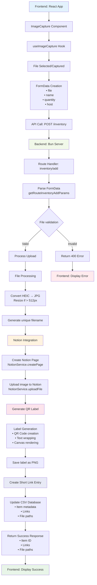

# ⚙️ Technical Flow

## Technical Architecture

This diagram illustrates the complete technical stack and data flow:

- **Frontend**: React app with custom hooks for image capture and file handling
- **Backend**: Bun server with modular route handlers and services
- **Processing Pipeline**: File conversion, validation, and optimization
- **External Integration**: Notion API for page creation and file uploads
- **Label Generation**: Canvas-based QR code and text rendering
- **Data Persistence**: Multiple storage layers (CSV, SQLite, file system)
- **Error Handling**: Comprehensive validation and error response flow
