# 👤 User Flow

```mermaid
flowchart TD
    A["User opens app"] --> B[Click Choose Photo]
    B --> C{"Mobile or Desktop?"}
    
    C -->|Mobile| D["Native picker opens<br/>📷 Take Photo<br/>📱 Photo Library<br/>📂 Browse Files"]
    C -->|Desktop| E["File browser opens"]
    
    D --> F["User selects/takes photo"]
    E --> F
    
    F --> G["Image preview appears"]
    G --> H["User enters item name"]
    H --> I["User sets quantity<br/>(defaults to 1)"]
    I --> J["User clicks Add to Inventory"]
    
    J --> K["Processing indicator shows"]
    K --> L{"Upload successful?"}
    
    L -->|Yes| M["Success message with:<br/>• Short link<br/>• Notion page link<br/>• Image links"]
    L -->|No| N["Error message displayed"]
    
    M --> O["User can:<br/>• Add another item<br/>• Visit Notion page<br/>• Download label"]
    N --> P["User can retry upload"]
    
    P --> H
    O --> Q["End"]
    
    style A fill:#e1f5fe
    style M fill:#e8f5e8
    style N fill:#ffebee
    style Q fill:#f3e5f5
```

## Flow Description

This diagram shows the complete user journey from opening the app to successfully adding an inventory item. Key features:

- **Cross-platform support**: Different experiences for mobile (camera/photo library) vs desktop (file browser)
- **Error handling**: Clear error states with retry options
- **Success outcomes**: Multiple options for what users can do after successful upload
- **Intuitive workflow**: Logical progression from image selection through form completion to submission
